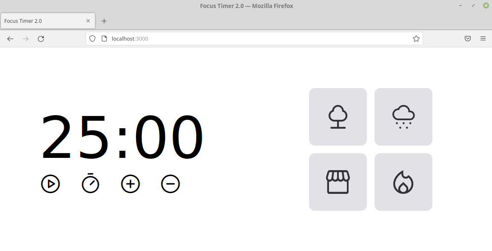

# Focus Timer 2.0 

O Focus Timer 2.0 é um projeto desenvolvido no treinamento web [rocketseat](https://www.rocketseat.com.br/)

Os conceitos principais aplicados nessa atividade foram:

- [CSS Grid Layout](https://www.w3schools.com/css/css_grid.asp)
- [Javascript Modules](https://developer.mozilla.org/en-US/docs/Web/JavaScript/Guide/Modules)
- [HTMLAudioElement](https://developer.mozilla.org/en-US/docs/Web/API/HTMLAudioElement)


<p align="center">
    
</p>


## Início Rápido

```bash
git@github.com:realfabecker/focus-timer-02.git
cd focus-timer-02
npx serve
```

## Contribuições

Refira-se ao guia de [contribuições](./docs/CONTRIBUTING.md) para detalhes de como contribuir para o projeto.

## Licença

Este projeto considera a licença MIT.

[project-link]: https://github.com/realfabecker/focus-timer-02